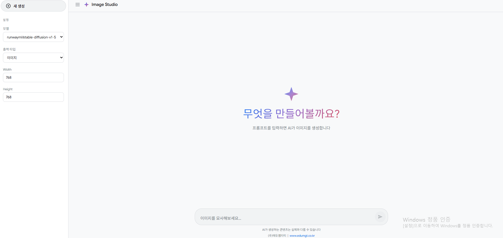

# python-generate-image

간단한 Python 기반 이미지/영상 생성 실험 저장소입니다.  
이제 단일 FastAPI 백엔드 모듈과 프런트엔드가 결합된 **생성 스튜디오** 형태로 동작합니다.



## 웹 스튜디오 기능

- Hugging Face 모델 선택
- 이미지/동영상(미리보기 GIF) 생성 모드 선택
- 이미지 Width/Height 입력
- 동영상 사이즈 선택 (square / landscape / portrait)
- 프롬프트 입력 후 결과 생성 및 미리보기

## API

- `GET /api/health`
- `GET /api/options`
- `POST /api/generate`
- `GET /api/files`
- `GET /outputs/{filename}`

## 로컬 실행

```bash
python3 -m venv .venv
source .venv/bin/activate
pip install -r backend/requirements.txt
uvicorn backend.main:app --reload
```

브라우저에서 `http://localhost:8000` 접속.

## Docker 실행

```bash
docker compose up --build
```

브라우저에서 `http://localhost:8000` 접속.

## 테스트

```bash
pytest -q
```
